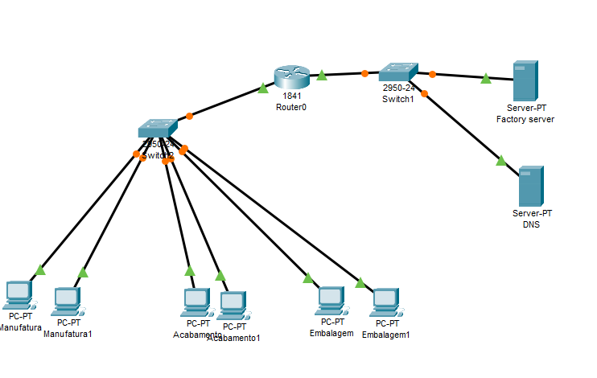

# Redes: dos conceitos iniciais à criação de uma intranet

## Sobre o Curso

Este projeto foi desenvolvido durante o curso "Redes: dos conceitos iniciais à criação de uma intranet", oferecido pela Alura. Com uma carga horária total de 12 horas e um progresso de 100%, o curso proporcionou um entendimento aprofundado sobre a organização e funcionamento de redes de computadores, incluindo a internet.

### Objetivos do Curso
- Entender como as redes de computadores se organizam.
- Analisar o funcionamento da internet.
- Selecionar e configurar dispositivos de rede.
- Construir uma rede corporativa.
- Conectar servidores em uma rede.
- Avaliar e selecionar conexões e protocolos de comunicação.

## Sobre o Arquivo .pkt

O arquivo `.pkt` contém a simulação da rede construída durante o curso, utilizando o software Packet Tracer. Os servidores foram configurados com IPs estáticos, enquanto os computadores estão utilizando o DHCP configurado para atribuição automática de endereços IP. O servidor da fábrica hospeda um site estático acessível pelo endereço www.fabrica.com, que foi disponibilizado por meio do serviço DNS configurado.

## Visualização da Rede

Abaixo está a imagem representativa da rede montada no curso, exibindo a configuração dos computadores, switches, roteadores e servidores.

